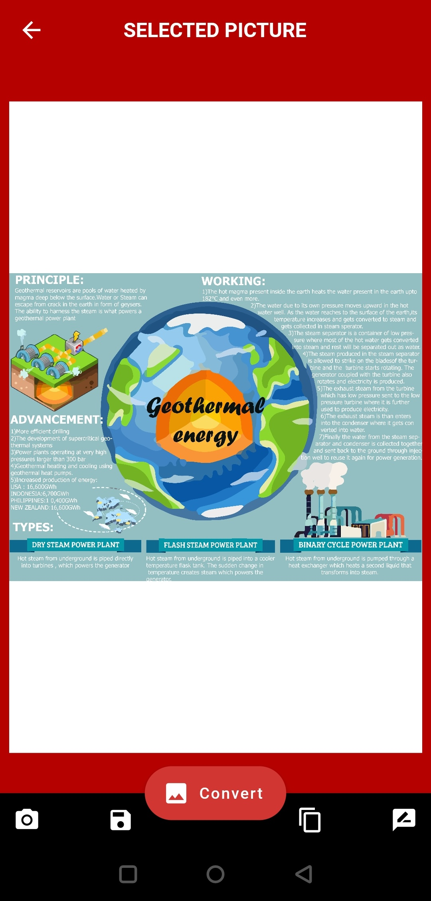
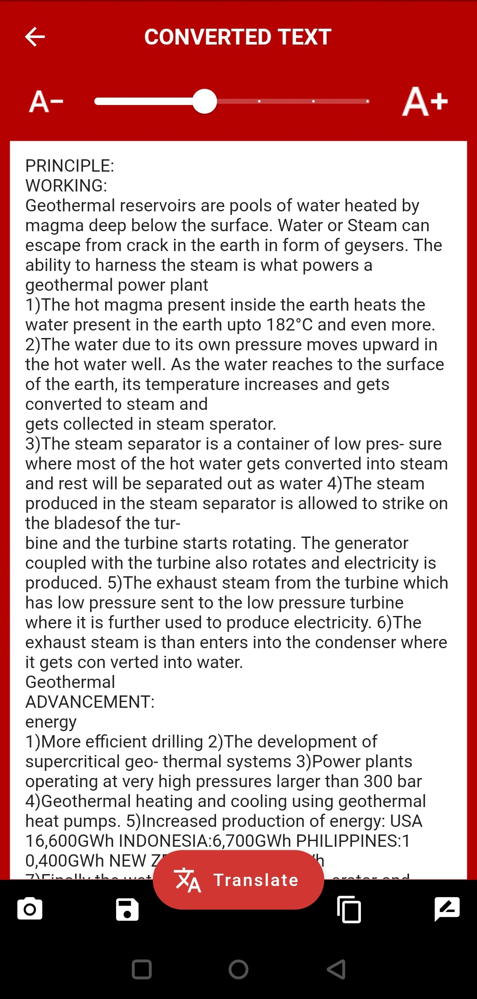
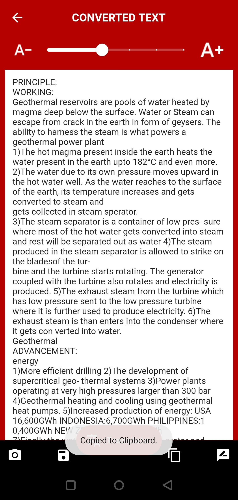
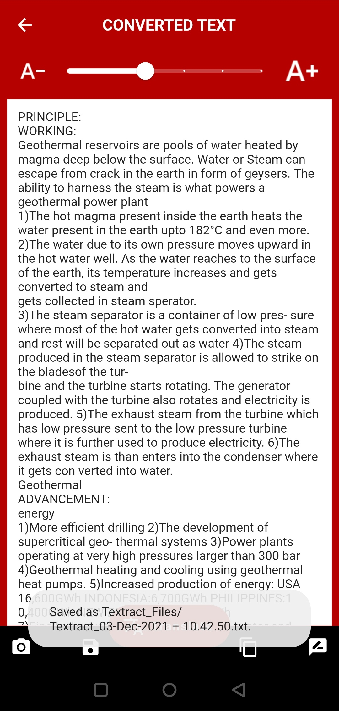
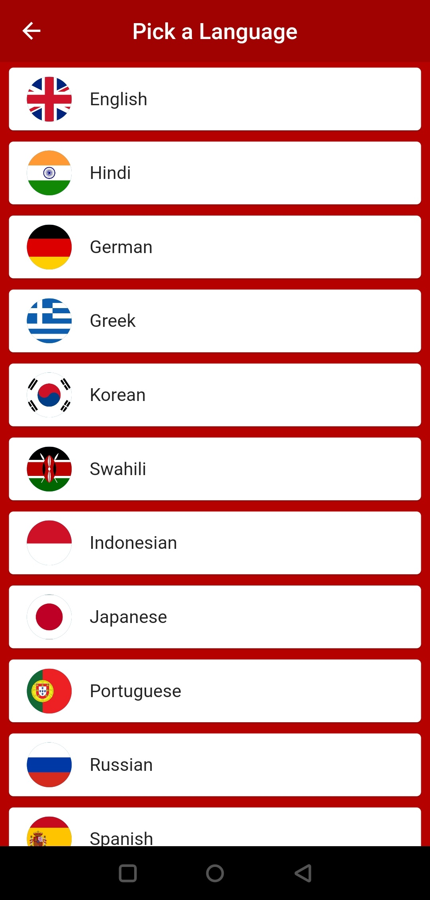
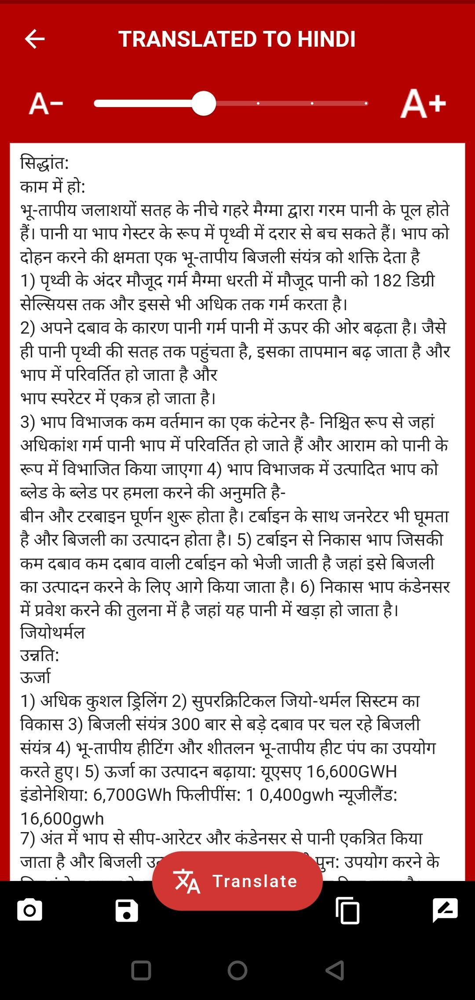
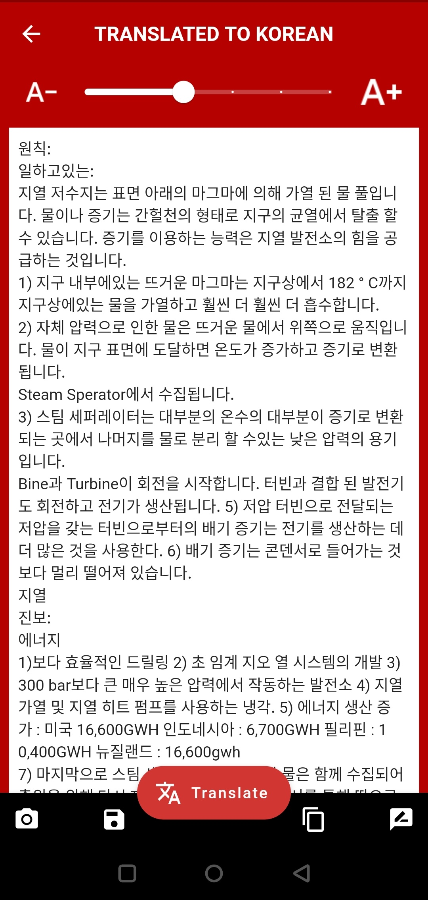

# TEXTRACT

An OCR based application to extract text from any image and translate it to different languages.

## Description

Welcome to Textract.
Have you ever needed to extract text from a picture but couldn't and ended up having to type it in by hand? If that's the case, Textract is the tool you've been looking for. Textract will make extracting text from any image a breeze with just one click.

## Features

1. Accepting images from users.
2. Providing an option to click a new picture or select an existing image from the gallery.
3. Extracting Text from the selected or captured images.
4. Saving the extracted text in a file or copying it to clipboard.
5. Providing an in-built translator to translate converted text to any other language the user wants.
6. An easy to use,accessible, flexible and appealing User Interface to aid throughout the process.
7. Providing the user with a feedback form inorder to get a review of the users experience and providing an option to rate our app.

## Steps to Use 

### Step 1 
Simply choose an image from the gallery or take a new one.

The Selected Image will be displayed on the Preview Screen.

### Step 2 
By pressing the convert button, you may now transform the image to text.

By Clicking on the Copy to Clipboard Button the Extracted Text will be copied.The user is now free to paste this text where they want.

The user can also Save the Extracted Text in a .txt file by clicking on the Save As Text button 

### Step 3 
You can also use the Translate button to switch from one language to another. The user can choose from the list of available languages.

After selecting a language the text will be translated.

The user can continue to translate the text as many times as they want.

## Stack

- Dart
- Flutter
- Firebase for Backend.
- Azure OCR/Firebase ML Vision for Image to Text Conversion.
- Google Cloud Translate/Azure Text Translation for translating text from one language to another.
